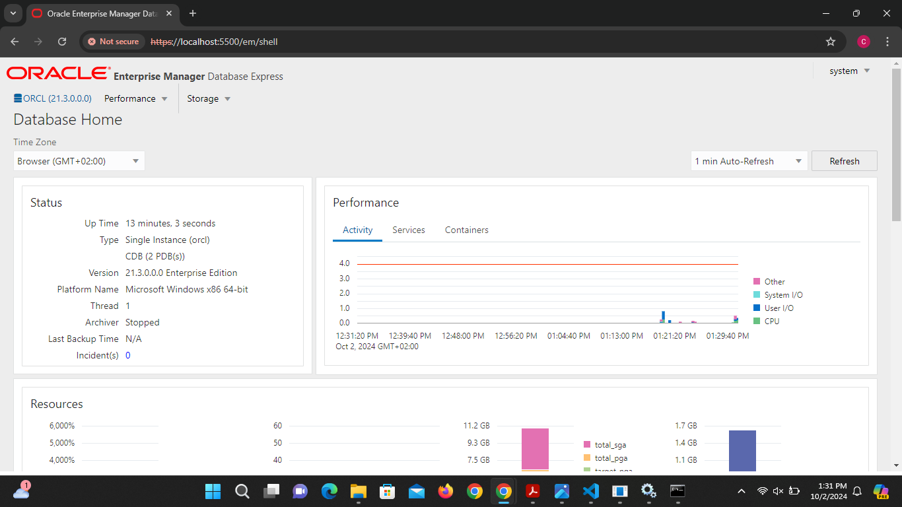

##Creating First Pdb 
CREATE PLUGGABLE DATABASE plsql_class2024db 
ADMIN USER la_plsqlauca IDENTIFIED BY 1234 
FILE_NAME_CONVERT = ('C:\Oracle_21c\oradata\ORCL\pdbseed', 'C:\Oracle_21c\oradata\ORCL\orclpdb\plsql_class2024db');
##Connecting To Pdb Using Sql Developer

##Pdb Created Successfully

##Creating New Pdb
CREATE PLUGGABLE DATABASE la_to_delete_pdb
   ADMIN USER new_user IDENTIFIED BY 1234
   FILE_NAME_CONVERT = ('C:\Oracle_21c\oradata\ORCL\pdbseed', 'C:\Oracle_21c\oradata\ORCL\orclpdb\la_to_delete_pdb');
##New Pdb Created Successfully

##Delete New Pdb
DROP PLUGGABLE DATABASE la_to_delete_pdb INCLUDING DATAFILES;

 
##Login to Oracle Enterprise Manager
  
##Oracle Enterprise Manager Dashboard
